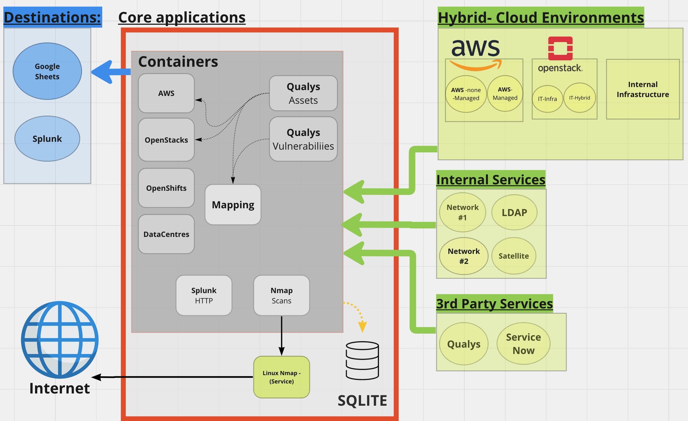
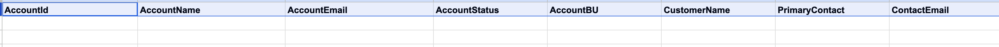
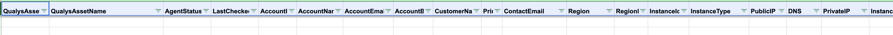
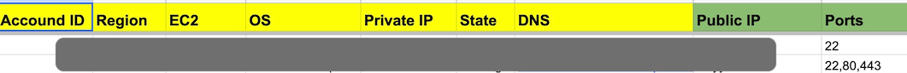

# Assets-Ownerships-Vulnerabilities Mapping 

**Description:** This project is intended to be opensource @ Github.com

**Author(s):** dtaler & bplaxco

**Data Retention Policy:** Currently N/A (it only forwards to qualys)


**High-level Arch Design:**





**Results - GSheets:**



**Results - GSheets:**



**Results - GSheets:**




## Contents

[[_TOC_]]

## Developer Access

### Local Publishing / Deployment

`make clean test build publish` requires:


Requirements:

```
ansible
make
podman
python3
python3-devel
```

Also take a look through the Makefile for any custom targets

Credentials:

Credentials can be placed in an env file at `~/.config/qualys-automation/env`
and that will be loaded into the container when running `make run` for local
testing. Different scripts may require different env variables to be set,
so take a look at the script that your testing to see what it needs.


### First Time Deployment Notes

The deploy is completely handled through the automation, and should work
even to new hosts as long as the pipeline deploy key is on that host, the host
can access the quay.io repo, and the pipeline user passwordless sudo.

## New Jobs

To add a new job:

1. Add a script with the job's name in `scripts/jobs`
1. Add an entry to `scripts/etc/cron.d/qualys-automation` to schedule it.

Jobs will be placed in the container at `/opt/app-root/jobs` during a build.
Use existing jobs as a reference. Jobs should simply log to stdout/err and
the entry in the crontab should handle redirecting output. Output should be
redirected like `&>> /opt/app-root/var/log/app/<job-name>.log`.

Jobs are wrapped scripts instead of putting them directly in the crontab to
avoid misc issues that you can run into adding it directly in the crontab.

Jobs should start out with something like:

```
#! /bin/bash
set -euo pipefail
source /opt/app-root/etc/app/env
```

To error out properly and to pull in vars that define credentials for the
jobs.

## Non-Standard Make Tasks

Currently there are none, but if you define custom Makefile targets for normal
dev tasks add the notes here
